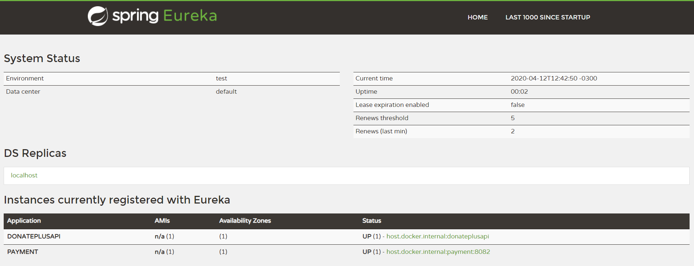
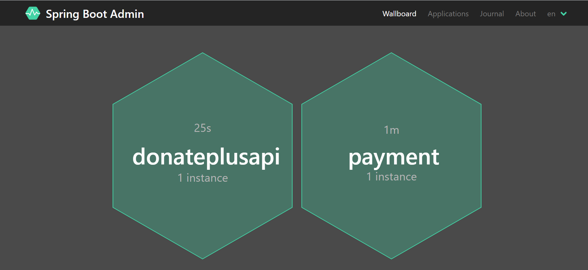
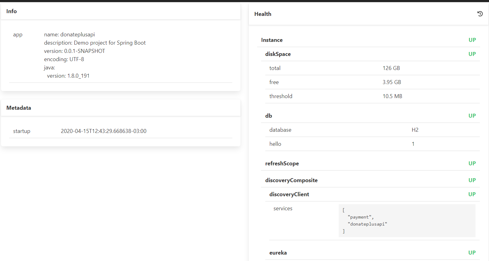

API - Aplicação DOE Mais - Microservices

Exemplo de uma aplicação em Spring Boot e Eureka utilizando microserviços

## Construído com:

- [Spring Boot](https://spring.io/projects/spring-boot) - Responsável por criar o microserviço e realizar o seu processamento e persistência.
- [Maven](https://maven.apache.org/) - Ferramenta de build automático.
- [Junit](https://junit.org/junit5/) - Ferramenta utilizar para criação dos testes unitários
- [Mockito](https://site.mockito.org/) - Ferramenta utilizada para realizar mock de objetos referente a limitação de ambiente(dev,teste e produção).
- [Docker](https://www.docker.com/) - Ferramenta utilizada para simular o ambiente de testes de forma íntegra.
- [Insominia](https://insomnia.rest/) - Ferramenta utilizada para realizar testes de chamadas via rest.
- [Swagger](https://swagger.io/) - Ferramenta utilizada para documentação da API construída neste projeto.
- [Jenkins](https://jenkins.io/) - Ferramenta responsável pela execução da automatização de testes e integração contínua.
- [Eureka](https://jenkins.io/) - Service Discovery

## Solução

